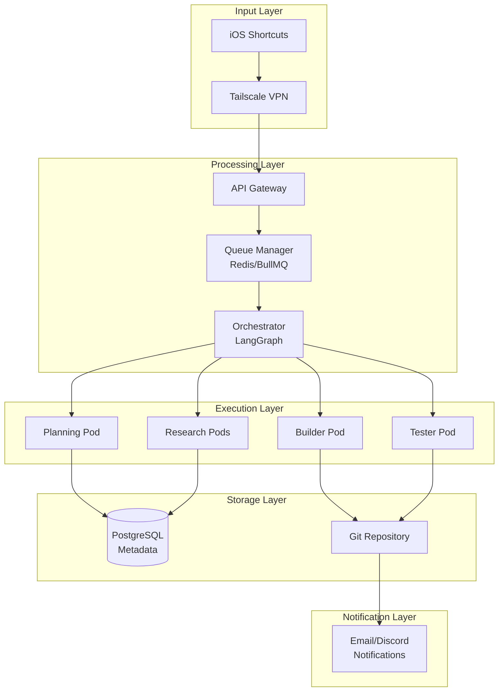
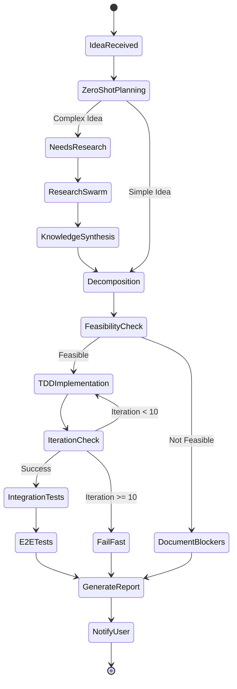

# Product Requirements Document
## Research Automation Swarm System

**Version:** 1.0  
**Date:** November 1, 2025  
**Author:** Research Automation Team  
**Status:** Ready for Implementation

---

## 1. Executive Summary

### 1.1 Product Vision
A personal AI research swarm that instantly captures "flood thoughts" and autonomously produces actionable research or working prototypes through an orchestrated multi-agent system.

### 1.2 Problem Statement
Researchers and developers experience spontaneous ideas during various activities that require immediate capture and systematic exploration. Current solutions lack the automation to transform these ideas into comprehensive research and functional prototypes without manual intervention.

### 1.3 Solution Overview
An automated pipeline that:
- Captures ideas through quick mobile interface
- Deploys intelligent agents for research and analysis
- Makes autonomous decisions about implementation feasibility
- Builds functional prototypes using TDD methodology
- Delivers tested code or comprehensive research reports

### 1.4 Success Metrics
- Idea capture time: < 10 seconds
- Research completion: < 15 minutes
- POC generation: < 30 minutes
- E2E test pass rate: > 80%
- Iteration limit: 10 attempts before fail-fast

---

## 2. User Stories & Requirements

### 2.1 Primary User Persona
**Profile:** Scientist-Developer  
- Background: Research scientist with development skills
- Pain Points: Ideas occur spontaneously, require immediate capture
- Goals: Transform ideas into validated prototypes or research documents
- Technical Proficiency: High (can self-host, configure systems)

### 2.2 Core User Stories

#### Story 1: Idea Capture
```
AS A scientist-developer experiencing "flood thoughts"
I WANT TO capture ideas instantly via mobile device
SO THAT no valuable insights are lost during activities
```

#### Story 2: Automated Research
```
AS A researcher with limited time
I WANT TO deploy automated agents to investigate ideas
SO THAT I receive comprehensive analysis without manual research
```

#### Story 3: Prototype Generation
```
AS A developer exploring concepts
I WANT TO automatically generate working prototypes
SO THAT I can validate ideas with minimal manual coding
```

### 2.3 Functional Requirements

| ID | Requirement | Priority | Phase |
|----|------------|----------|-------|
| FR1 | One-touch idea capture via iOS Shortcuts | Critical | 1 |
| FR2 | Natural language idea processing | Critical | 1 |
| FR3 | Automated research agent deployment | Critical | 1 |
| FR4 | Feasibility analysis and decision making | Critical | 1 |
| FR5 | Autonomous code generation with TDD | High | 1 |
| FR6 | Integration and E2E testing | High | 1 |
| FR7 | Repository-based output organization | Critical | 1 |
| FR8 | Email/webhook notifications | Medium | 1 |
| FR9 | Human-in-the-loop decision points | High | 2 |
| FR10 | Multi-user support | Low | 2 |

### 2.4 Non-Functional Requirements

| ID | Requirement | Target | Priority |
|----|------------|--------|----------|
| NFR1 | Idea capture latency | < 10 seconds | Critical |
| NFR2 | Research phase timeout | < 15 minutes | High |
| NFR3 | Implementation timeout | < 30 minutes | High |
| NFR4 | System availability | 95% uptime | Medium |
| NFR5 | Concurrent idea processing | 1 (Phase 1) | Low |
| NFR6 | Security via VPN | Tailscale encryption | Critical |

---

## 3. System Architecture

### 3.1 High-Level Architecture



### 3.2 Component Specifications

#### 3.2.1 Input Layer
- **Technology**: iOS Shortcuts + Tailscale VPN
- **Protocol**: HTTPS over WireGuard
- **Authentication**: Device-based via Tailscale
- **Input Format**: Plain text (idea description)

#### 3.2.2 Queue Management
- **Technology**: Redis + BullMQ
- **Features**:
  - Job persistence
  - Retry logic
  - Priority queuing
  - Dead letter queue
- **Configuration**:
  ```yaml
  max_retries: 3
  retry_delay: exponential_backoff
  job_timeout: 60_minutes
  concurrency: 1  # Phase 1
  ```

#### 3.2.3 Orchestration Engine
- **Technology**: LangGraph
- **Features**:
  - Dynamic graph construction
  - State persistence
  - Conditional branching
  - Streaming updates
- **Workflow States**:
  - RECEIVED
  - PLANNING
  - RESEARCHING
  - DECOMPOSING
  - BUILDING
  - TESTING
  - COMPLETED
  - FAILED

#### 3.2.4 Execution Pods
Each pod runs in isolated container with specific toolsets:

| Pod Type | Base Image | Key Tools | Timeout |
|----------|------------|-----------|---------|
| Planner | python:3.11-slim | OpenAI, LangChain | 5 min |
| Research | python:3.11-slim | BeautifulSoup, Requests, SerpAPI | 15 min |
| Builder | node:20-alpine | NPM, Python, Swift tools | 30 min |
| Tester | playwright/python | Pytest, Jest, Cypress | 10 min |

### 3.3 Infrastructure

#### Development Environment (Phase 1)
- **Platform**: macOS with OrbStack / Linux with Docker
- **Orchestration**: Local Kubernetes (OrbStack)
- **Storage**: Local filesystem + PostgreSQL
- **Networking**: Tailscale mesh network

#### Production Environment (Phase 2)
- **Platform**: Cloud (RunPod/GitHub Codespaces)
- **Orchestration**: Managed Kubernetes
- **Storage**: Cloud storage + Managed PostgreSQL
- **Networking**: Cloud VPN + Load Balancer

---

## 4. Phase Definitions & Workflows

### 4.1 Execution Pipeline



### 4.2 Phase Specifications

#### Phase 1: Zero-Shot Planning (0-5 minutes)
**Purpose**: Initial analysis and routing decision

**Process**:
1. Parse idea using LLM
2. Identify key components and requirements
3. Classify complexity (Simple/Medium/Complex)
4. Determine research needs
5. Create initial task outline

**Output**:
```json
{
  "idea_id": "uuid",
  "complexity": "medium",
  "needs_research": true,
  "research_areas": ["API documentation", "SDK availability"],
  "estimated_effort": "2 hours",
  "initial_tasks": ["Research APIs", "Design architecture", "Build POC"]
}
```

#### Phase 2: Research Swarm (0-15 minutes)
**Purpose**: Parallel information gathering

**Agent Types**:
- **API Scout**: Finds relevant APIs and documentation
- **Code Hunter**: Searches for similar implementations
- **Compliance Checker**: Reviews legal/privacy requirements
- **Tool Finder**: Identifies optimal frameworks/libraries

**Parallel Execution**:
```python
research_agents = [
    APIScoutAgent(query=idea.api_requirements),
    CodeHunterAgent(query=idea.similar_projects),
    ComplianceAgent(query=idea.data_handling),
    ToolFinderAgent(query=idea.tech_stack)
]

results = await asyncio.gather(*[agent.research() for agent in research_agents])
```

#### Phase 3: Knowledge Synthesis & Decomposition (5-10 minutes)
**Purpose**: Consolidate research and create implementation plan

**Process**:
1. Aggregate research findings
2. Identify conflicts or gaps
3. Create detailed technical specification
4. Decompose into atomic tasks
5. Assign priority and dependencies

**Output Structure**:
```yaml
synthesis:
  feasible: true
  confidence: 0.85
  blockers: []
  
implementation_plan:
  tasks:
    - id: task_1
      description: "Set up project structure"
      priority: 1
      dependencies: []
      estimated_time: 5min
    
    - id: task_2
      description: "Implement API client"
      priority: 2
      dependencies: [task_1]
      estimated_time: 15min
```

#### Phase 4: TDD Implementation (10-30 minutes)
**Purpose**: Build working prototype

**Methodology**:
1. Write test first (RED)
2. Implement minimal code (GREEN)
3. Refactor if needed (REFACTOR)
4. Iterate until complete or max iterations

**Tool Selection Priority**:
```python
TOOL_MATRIX = {
    "web_app": ["Next.js + Vercel", "Streamlit", "FastHTML"],
    "mobile_app": ["PWA", "React Native Expo", "SwiftUI"],
    "chrome_extension": ["Manifest V3", "Plasmo"],
    "api_integration": ["Direct HTTP", "Official SDK"],
    "data_processing": ["Pandas", "DuckDB", "Polars"]
}
```

#### Phase 5: Testing & Validation (5-10 minutes)
**Purpose**: Ensure quality and requirements met

**Test Levels**:
1. Unit Tests (generated with code)
2. Integration Tests (API/service connections)
3. E2E Tests (full workflow validation)

**Pass Criteria**:
- Unit test coverage > 70%
- Integration tests pass
- E2E tests demonstrate core functionality

---

## 5. Decision Matrices & Thresholds

### 5.1 Complexity Assessment Matrix

| Factor | Simple (1 point) | Medium (2 points) | Complex (3 points) |
|--------|-----------------|-------------------|-------------------|
| Dependencies | < 3 | 3-5 | > 5 |
| APIs | Single, public | 2-3, authenticated | Multiple, complex auth |
| UI Requirements | CLI/simple web | Basic mobile/web app | Rich interactive UI |
| Data Processing | < 1GB, simple | 1-10GB, moderate | > 10GB, ML required |
| Time Estimate | < 30 min | 30-90 min | > 90 min |

**Decision Rules**:
- Score 1-3: Auto-proceed
- Score 4-7: Proceed with simplifications
- Score 8-10: Human approval required
- Score > 10: Reject as out of scope

### 5.2 API Complexity Framework

```yaml
API_Complexity_Levels:
  Level_1_Simple:
    characteristics:
      - Public/No authentication
      - RESTful with clear documentation
      - Direct SDK available
      - Rate limits > 1000/hour
    examples: [OpenWeather, JSONPlaceholder]
    decision: Auto-implement
    
  Level_2_Medium:
    characteristics:
      - OAuth/API key required
      - GraphQL or complex REST
      - SDK needs configuration
      - Rate limits 100-1000/hour
    examples: [Twitter API, GitHub API]
    decision: Implement with fallbacks
    
  Level_3_Complex:
    characteristics:
      - Multi-step authentication
      - Poor/no documentation
      - Rate limits < 100/hour
      - Webhook requirements
    examples: [Banking APIs, Healthcare APIs]
    decision: Mock implementation + research doc
    
  Level_4_Impossible:
    characteristics:
      - Manual approval required
      - Closed/Private API
      - Legal restrictions
      - Hardware dependencies
    examples: [Internal corporate APIs, Medical devices]
    decision: Document blockers, suggest alternatives
```

### 5.3 Iteration & Failure Thresholds

```python
ITERATION_RULES = {
    "max_iterations": 10,
    "backoff_strategy": "exponential",
    "failure_conditions": [
        "api_permanently_unavailable",
        "legal_restriction_identified",
        "cost_exceeds_threshold",
        "security_vulnerability_detected"
    ],
    "partial_success_criteria": {
        "core_feature_complete": True,
        "secondary_features": "best_effort",
        "test_coverage": "> 50%"
    }
}
```

### 5.4 Human-in-the-Loop (HITL) Decision Points

```yaml
HITL_Triggers:
  ambiguous_requirements:
    condition: "Multiple valid interpretations"
    questions:
      - "Should this integrate with {system_x} or be standalone?"
      - "Priority: Speed vs Accuracy vs Cost?"
    timeout: 5_minutes
    default: "Choose simplest interpretation"
    
  complex_implementation:
    condition: "Multiple technical approaches"
    questions:
      - "Found {n} approaches. Preference: Quick hack / Proper architecture?"
      - "API requires paid tier. Proceed with mock data?"
    timeout: 5_minutes
    default: "Choose quickest approach"
    
  partial_failure:
    condition: "Core works, extras failed"
    questions:
      - "Core feature works, {n} advanced features failed. Ship as-is?"
      - "Tests failing for edge cases. Acceptable?"
    timeout: 5_minutes
    default: "Ship core features only"
    
  cost_concern:
    condition: "Estimated cost > $10"
    questions:
      - "This will cost ~${amount}. Proceed?"
      - "Free tier exhausted. Upgrade or mock?"
    timeout: 10_minutes
    default: "Use free tier only"
```

---

## 6. Technical Specifications

### 6.1 API Specifications

#### 6.1.1 Idea Submission Endpoint
```yaml
endpoint: POST /api/v1/ideas
authentication: Tailscale device auth
request:
  content-type: application/json
  body:
    idea: string (required, max 1000 chars)
    priority: enum [low, medium, high, urgent]
    context: string (optional)
    constraints: object (optional)
response:
  200:
    idea_id: uuid
    status: "queued"
    estimated_completion: timestamp
    tracking_url: string
  400:
    error: "Invalid request"
  500:
    error: "Server error"
```

#### 6.1.2 Status Check Endpoint
```yaml
endpoint: GET /api/v1/ideas/{idea_id}/status
authentication: Tailscale device auth
response:
  200:
    idea_id: uuid
    status: enum [queued, processing, completed, failed]
    current_phase: string
    progress_percentage: integer
    logs: array[string]
    result_url: string (if completed)
```

### 6.2 LangGraph Workflow Definition

```python
from langgraph.graph import StateGraph, END
from typing import TypedDict, List, Optional

class ResearchState(TypedDict):
    idea_id: str
    idea_text: str
    complexity: str
    research_needed: bool
    research_results: Optional[List[dict]]
    implementation_plan: Optional[dict]
    code_artifacts: Optional[List[str]]
    test_results: Optional[dict]
    iteration_count: int
    final_output: Optional[dict]

# Define the workflow
workflow = StateGraph(ResearchState)

# Add nodes
workflow.add_node("planner", zero_shot_planning)
workflow.add_node("researcher", research_swarm)
workflow.add_node("synthesizer", knowledge_synthesis)
workflow.add_node("decomposer", task_decomposition)
workflow.add_node("builder", tdd_implementation)
workflow.add_node("tester", integration_testing)
workflow.add_node("reporter", generate_report)

# Add edges with conditions
workflow.add_conditional_edges(
    "planner",
    lambda x: x["research_needed"],
    {
        True: "researcher",
        False: "decomposer"
    }
)

workflow.add_edge("researcher", "synthesizer")
workflow.add_edge("synthesizer", "decomposer")

workflow.add_conditional_edges(
    "decomposer",
    lambda x: x["implementation_plan"]["feasible"],
    {
        True: "builder",
        False: "reporter"
    }
)

workflow.add_conditional_edges(
    "builder",
    lambda x: check_build_status(x),
    {
        "success": "tester",
        "retry": "builder",
        "fail": "reporter"
    }
)

workflow.add_edge("tester", "reporter")
workflow.add_edge("reporter", END)

# Set entry point
workflow.set_entry_point("planner")

# Compile
app = workflow.compile()
```

### 6.3 Container Specifications

```dockerfile
# Base image for Planning Pod
FROM python:3.11-slim as planner-pod
WORKDIR /app
RUN pip install langchain openai tiktoken pydantic
COPY agents/planner.py /app/
CMD ["python", "planner.py"]

# Base image for Research Pod
FROM python:3.11-slim as research-pod
WORKDIR /app
RUN pip install beautifulsoup4 requests serpapi arxiv-py scholarly
COPY agents/researcher.py /app/
CMD ["python", "researcher.py"]

# Base image for Builder Pod
FROM node:20-alpine as builder-pod
WORKDIR /app
RUN apk add --no-cache python3 py3-pip swift
RUN npm install -g typescript eslint prettier
COPY agents/builder.js /app/
CMD ["node", "builder.js"]

# Base image for Tester Pod
FROM mcr.microsoft.com/playwright/python:v1.40.0 as tester-pod
WORKDIR /app
RUN pip install pytest pytest-asyncio pytest-cov
COPY agents/tester.py /app/
CMD ["python", "tester.py"]
```

### 6.4 Output Repository Structure

```
/research-repository/
├── README.md                          # Repository overview
├── ideas/
│   └── 2025-11-01-heartrate-monitor/  # Timestamp-name format
│       ├── metadata.json              # Idea metadata and status
│       ├── research/
│       │   ├── README.md              # Research summary
│       │   ├── feasibility.md         # Technical analysis
│       │   ├── references.md          # Sources and citations
│       │   └── decision.md            # Go/No-go recommendation
│       ├── plan/
│       │   ├── architecture.md        # System design
│       │   ├── tasks.json             # Decomposed tasks
│       │   └── estimates.md           # Time/cost estimates
│       ├── implementation/             # (If POC approved)
│       │   ├── src/                   # Source code
│       │   ├── tests/                 # Test files
│       │   ├── docs/                  # Documentation
│       │   ├── package.json           # Dependencies
│       │   └── README.md              # Setup instructions
│       └── results/
│           ├── test-report.html       # Test results
│           ├── coverage.html          # Code coverage
│           └── summary.md             # Final summary
```

---

## 7. Testing Strategy

### 7.1 Test Levels

#### Level 1: Unit Tests (Generated with Code)
- **Coverage Target**: > 70%
- **Framework**: Language-specific (pytest, jest, XCTest)
- **Automation**: Generated alongside implementation
- **Focus**: Function-level correctness

#### Level 2: Integration Tests
- **Coverage Target**: All external dependencies
- **Framework**: Pytest + mocking for APIs
- **Automation**: Template-based generation
- **Focus**: Service interactions, data flow

#### Level 3: End-to-End Tests
- **Coverage Target**: Critical user paths
- **Framework**: Playwright/Cypress
- **Automation**: Scenario-based generation
- **Focus**: Full workflow validation

### 7.2 Test Generation Strategy

```python
class TestGenerator:
    def generate_unit_tests(self, function_code: str) -> str:
        """Generate unit tests for given function"""
        # Parse function signature
        # Generate edge cases
        # Create pytest/jest test cases
        pass
    
    def generate_integration_tests(self, api_spec: dict) -> str:
        """Generate integration tests for API interactions"""
        # Mock external services
        # Test error handling
        # Validate data contracts
        pass
    
    def generate_e2e_tests(self, user_story: str) -> str:
        """Generate E2E tests from user story"""
        # Parse acceptance criteria
        # Create Playwright scenarios
        # Include assertions
        pass
```

### 7.3 Test Execution Pipeline

```yaml
test_pipeline:
  - stage: unit_tests
    parallel: true
    fail_fast: false
    timeout: 5_minutes
    
  - stage: integration_tests
    parallel: false
    fail_fast: true
    timeout: 10_minutes
    retry: 2
    
  - stage: e2e_tests
    parallel: false
    fail_fast: true
    timeout: 15_minutes
    retry: 1
    
  reporting:
    format: [junit, html, markdown]
    coverage: [cobertura, lcov]
    artifacts: [screenshots, logs, traces]
```

---

## 8. Monitoring & Notifications

### 8.1 Metrics & Logging

```yaml
metrics:
  business:
    - ideas_processed_per_day
    - success_rate
    - average_processing_time
    - poc_generation_rate
    
  technical:
    - pod_utilization
    - queue_depth
    - api_call_count
    - error_rate
    
  quality:
    - test_coverage
    - test_pass_rate
    - code_complexity
    - documentation_completeness

logging:
  level: INFO
  format: structured_json
  destinations:
    - stdout
    - file: /logs/research-swarm.log
    - elasticsearch: optional
  
  retention:
    debug: 1_day
    info: 7_days
    error: 30_days
```

### 8.2 Notification Configuration

```yaml
notifications:
  channels:
    email:
      enabled: true
      smtp_server: smtp.gmail.com
      recipients: [user@example.com]
      
    discord:
      enabled: true
      webhook_url: ${DISCORD_WEBHOOK_URL}
      
    pushover:
      enabled: false
      api_key: ${PUSHOVER_API_KEY}
      
  events:
    idea_received:
      channels: []
      template: "Idea {id} queued for processing"
      
    research_complete:
      channels: [discord]
      template: "Research complete for {idea_title}"
      
    poc_generated:
      channels: [email, discord]
      template: "POC ready: {repository_url}"
      attachments: [summary.md, test-report.html]
      
    processing_failed:
      channels: [email, discord]
      template: "Processing failed: {error_message}"
      
    human_input_needed:
      channels: [email, pushover]
      template: "Input needed: {question}"
      action_url: ${BASE_URL}/hitl/{idea_id}
```

### 8.3 Alerting Rules

```yaml
alerts:
  high_queue_depth:
    condition: queue_size > 10
    severity: warning
    action: notify_admin
    
  processing_timeout:
    condition: processing_time > 60_minutes
    severity: error
    action: kill_pod_and_retry
    
  high_failure_rate:
    condition: failure_rate > 0.3 over 1_hour
    severity: critical
    action: pause_processing_and_alert
    
  resource_exhaustion:
    condition: memory_usage > 90% or cpu_usage > 90%
    severity: warning
    action: scale_resources
```

---

## 9. Security & Privacy

### 9.1 Security Requirements

```yaml
authentication:
  method: Tailscale device-based
  encryption: WireGuard (Tailscale)
  api_keys: Environment variables
  secrets_management: HashiCorp Vault (Phase 2)

authorization:
  model: Single user (Phase 1)
  future: RBAC with teams (Phase 2)

data_protection:
  at_rest: Encrypted filesystem
  in_transit: TLS 1.3+ / WireGuard
  sensitive_data: Redacted in logs
  pii_handling: GDPR compliant

code_security:
  dependency_scanning: Snyk/Dependabot
  static_analysis: Semgrep
  secrets_scanning: GitGuardian
  sandbox_execution: Docker containers
```

### 9.2 Privacy Considerations

```yaml
data_handling:
  retention:
    ideas: Indefinite (user-controlled)
    logs: 30 days
    metrics: 90 days
    
  user_data:
    storage_location: Local only (Phase 1)
    backup: User responsibility
    sharing: Never without consent
    
  ai_interactions:
    model_providers: OpenAI, Anthropic
    data_sent: Idea text only
    no_training: Opt-out configured
    api_logging: Disabled
```

---

## 10. Implementation Roadmap

### 10.1 Phase 1: MVP (Weeks 1-4)

#### Week 1: Core Infrastructure
- [ ] Set up OrbStack/Docker environment
- [ ] Configure Tailscale VPN
- [ ] Implement Redis queue
- [ ] Create base container images

#### Week 2: Basic Pipeline
- [ ] Implement planning agent
- [ ] Create simple research agent
- [ ] Set up LangGraph orchestration
- [ ] Build Git repository structure

#### Week 3: Code Generation
- [ ] Implement TDD builder agent
- [ ] Add unit test generation
- [ ] Create integration test templates
- [ ] Implement fail-fast logic

#### Week 4: Integration & Polish
- [ ] Create iOS Shortcut
- [ ] Set up notifications
- [ ] Add monitoring/logging
- [ ] End-to-end testing
- [ ] Documentation

### 10.2 Phase 2: Enhancements (Weeks 5-8)

#### Week 5-6: Advanced Features
- [ ] Multi-agent research swarm
- [ ] HITL decision interface
- [ ] Advanced tool selection matrix
- [ ] Parallel idea processing

#### Week 7-8: Production Readiness
- [ ] Cloud deployment option
- [ ] Multi-user support
- [ ] Web dashboard
- [ ] Advanced analytics

### 10.3 Phase 3: Scale (Future)

- Team collaboration features
- Custom agent creation
- Plugin ecosystem
- Enterprise features
- SaaS offering

---

## 11. Success Criteria

### 11.1 Acceptance Criteria

```yaml
functional:
  - Idea capture works offline and syncs
  - Research covers 80% of relevant sources
  - POC runs without manual intervention
  - Tests achieve > 70% coverage
  
performance:
  - 95% uptime
  - < 1% failure rate
  - Average processing < 30 minutes
  - Queue processing < 1 minute
  
quality:
  - Generated code passes linting
  - Documentation auto-generated
  - Security scan passes
  - No critical vulnerabilities
```

### 11.2 Definition of Done

- [ ] All acceptance criteria met
- [ ] Documentation complete
- [ ] Tests passing
- [ ] Code reviewed
- [ ] Deployed to environment
- [ ] Monitoring configured
- [ ] User notified

---

## 12. Risks & Mitigations

| Risk | Probability | Impact | Mitigation |
|------|------------|--------|------------|
| LLM API rate limits | Medium | High | Multiple API keys, caching, fallback models |
| Container resource exhaustion | Low | High | Resource limits, auto-scaling, monitoring |
| Infinite loops in generation | Medium | Medium | Iteration limits, timeouts, circuit breakers |
| Malicious code generation | Low | High | Sandboxed execution, code scanning |
| Data loss | Low | High | Git versioning, backups, redundancy |
| Tailscale connectivity issues | Low | Medium | Fallback to direct SSH, monitoring |

---

## 13. Budget Considerations

### 13.1 Phase 1 Costs (Monthly)

```yaml
infrastructure:
  hosting: $0 (self-hosted)
  storage: $0 (local)
  
api_costs:
  openai: ~$50 (GPT-4 calls)
  search_apis: ~$20 (SerpAPI)
  
tools:
  development: $0 (open source)
  monitoring: $0 (self-hosted)
  
total: ~$70/month
```

### 13.2 Phase 2 Costs (Monthly)

```yaml
infrastructure:
  cloud_hosting: ~$100
  managed_db: ~$30
  
api_costs:
  increased_usage: ~$200
  
tools:
  monitoring: ~$50
  ci_cd: ~$20
  
total: ~$400/month
```

---

## 14. Appendices

### Appendix A: Glossary

- **Flood Thoughts**: Spontaneous ideas requiring immediate capture
- **POC**: Proof of Concept
- **TDD**: Test-Driven Development
- **HITL**: Human-in-the-Loop
- **E2E**: End-to-End
- **Swarm**: Collection of autonomous agents

### Appendix B: References

- LangGraph Documentation: https://langchain-ai.github.io/langgraph/
- OrbStack: https://orbstack.dev/
- Tailscale: https://tailscale.com/
- MetaGPT: https://github.com/geekan/MetaGPT

### Appendix C: Contact Information

- Product Owner: [Jonatan Borkowski]
- Technical Lead: [Jonatan Borkowski]
- Repository: [GitHub URL]
- Support: [jonatan@thebo.me w]

---

## Document History

| Version | Date | Author | Changes |
|---------|------|--------|---------|
| 1.0 | 2025-11-01 | System | Initial PRD creation |

---

*This document serves as the authoritative specification for the Research Automation Swarm System. All implementation decisions should align with the requirements and constraints defined herein.*
